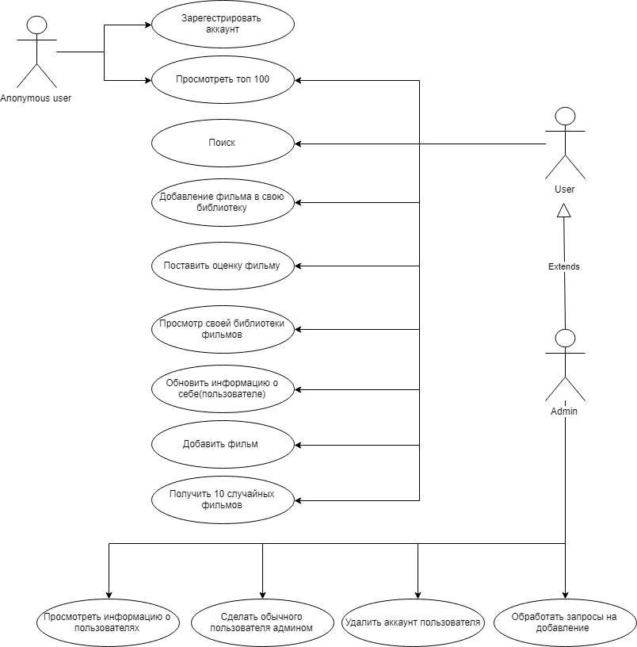

# Поектирование системы

## Содержание
  1. [Диаграмма вариантов использования](#1)  
  2. [Диаграммы активностей](#2)  
     2.1 [Регистрация](#2.1)  
     2.2 [Вход в систему](#2.2)  
     2.3 [Написание статьи](#2.3)  
     2.4 [Оценка информации](#2.4)  
     2.5 [Поиск информации](#2.5)  
  3. [Диаграмма последовательности](#3)  
     3.1 [Вход в систему](#3.1)  
     3.2 [Написание статьи](#3.2)  
     3.3 [Написание комментария](#3.3)  
     3.4 [Оценка информации](#3.4)  
  4. [Диаграмма классов](#4)  
  5. [Диаграммы состояний](#5)  
  6. [Диаграмма компонентов](#6)  

## 1 Диаграмма вариантов использования

Глоссарий, актёры и сценарии для каждого варианта использования описаны в [отдельном документе](UseCase/UseCase.md).

