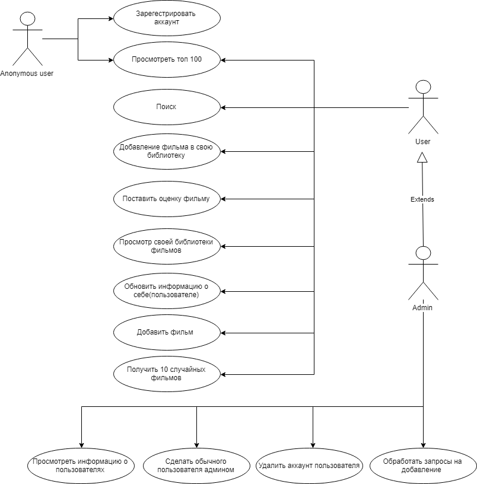

# Диаграмма вариантов использования

---

## Содержание
  1. [Глоссарий](#1)  
  2. [Актёры](#2)  
  3. [Варианты использования](#3)  
    3.1 [Зарегистрировать аккаунт](#3.1)  
    3.2 [Войти в систему](#3.2)  
    3.3 [Просмотреть топ 100](#3.3)  
    3.4 [Добавление фильма в свою библиотеку](#3.4)  
    3.5 [Поставить оценку фильму](#3.5)  
    3.6 [Просмотр своей библиотеки филмьов](#3.6)  
    3.7 [Добавить фильм](#3.7)  
    3.8 [Получить 10 случайных фильмов](#3.8)  
    3.9 [Просмотреть информацию о пользователях](#3.9)  
    3.10 [Сделать обычного пользователя администратором](#3.10)  
    3.11 [Удалить аккаунт пользователя](#3.11)  
    3.12 [Выйти из системы](#3.12)  

## 1 Глоссарий

 Список основных понятий, использованных при проектировании:

| Термин| Определение|
|:---|:---|
| Незарегистрированный пользователь | Человек, пользующийся сайтом без входа в систему |
| Зарегистрированный пользователь | Человек, вошедший в систему |
| Администратор | Человек, вошедший в систему с привилегированным доступом |
| Аккаунт | Логин и пароль пользователя, с помощью которых пользователь получает полный доступ ко всем функция приложения |

## 2 Актёры
Актёрами являются незарегистрированный пользователь, зарегистрированный пользователь и администратор. Их определения описаны в [глоссарии](#1).

## 3 Варианты использования
### 3.1 Зарегестрировать аакаунт 
**Описание:** вариант использования "Зарегестрировать аккаунт " позволяет пользователю создать свой аккаунт на сайте.  
**Предусловия:** незарегистрированный пользователь зашёл на страницу регистрации, нажав на кнопку "Sign up".

**Основной поток:**
1.  Сайт отображает страницу регистрации, на которой размещены поля ввода псевдонима, электронной почты, пароля и подтверждения пароля.
2.  Пользователь вводит свой псевдоним.
3.  Система проверят введённое имя на совпадение с псевдонимами уже зарегистрированных пользователей. Если совпадение выявлено, выполняется альтернативный поток A1.
4.  Пользователь вводит свою электронную почту.
5.  Система проверят введённую электронную почту на совпадение с елктронными почтами уже зарегистрированных пользователей. Если совпадение выявлено, выполняется альтернативный поток A2.
6.  Пользователь вводит свой пароль.
7.  Пользователь подтверждает свой пароль.
8.  Система проверят введённые пароли на совпадение. Если они различаются, выполняется альтернативный поток A3.
9.  Пользователь нажимает на кнопку "Sign Up". Если пользователь проигнорировал события из альтернативных поток A1 и A2, кнопка будет не активна (возврат к п.2 и п.4).
10.  Система добавляет пользователя в базу данных.
11.  На странице появляется сообщение об успешной регистрации.
12.  Вариант использования завершается.

**Альтернативный поток A1:**
1.  Над полем ввода появляется сообщение о том, что такой псевдоним уже используется.
2.  Возврат к п.2 основного потока.

 **Альтернативный поток A2:**
1.  Над полем ввода появляется сообщение о том, что такая электронная почта уже используется.
2.  Возврат к п.4 основного потока.
---

 **Альтернативный поток A3:**
1.  Над полем ввода появляется сообщение о том, что пароли не совпадают.
2.  Возврат к п.7 основного потока.
---

### 3.2 Войти в систему
**Описание:** вариант использования "Войти в систему " позволяет пользователю войти в свой аккаунт.  
**Предусловия:** незарегистрированный пользователь зашёл на страницу авторизации, нажав на кнопку "Sign In".

**Основной поток:**
1.  Сайт отображает страницу входа, на которой размещены поля ввода псевдонима и пароля.
2.  Пользователь вводит свой псевдоним и пароль.
3.  Пользователь нажимает на кнопку "Sign In".
4.  Система сверяет введённые данные с данными из базы данных. Если они не совпадают, выполняется альтернативный поток A4.
5.  У пользователя загружается главная страница под его профилем.
6.  Вариант использования завершается.

**Альтернативный поток A4:**
1.  На странице появляется сообщение о том, что введённые псевдоним и пароль неверны.
2.  Возврат к п.2 основного потока.
---

### 3.3 Просмотреть топ 100
**Описание:** вариант использования "Просмотреть топ 100" позволяет пользователю увидеть 100 лучших фильмов по оценке пользователей.

**Основной поток:**
1.  Пользователь нажимает на кнопку "Top 100".
2.  Пользователь вводит интересующую его информацию.
3.  У пользователя загружается страница со списком 100 лучших фильмов по оценке пользователей.
4.  Вариант использования завершается.

### 3.4 Добавление фильма в свою библиотеку
**Описание:** вариант использования "Добавление фильма в свою библиотеку" позволяет зарегистрированному пользователю добавить фильм в свою библиотеку.

**Основной поток:**
1.  Пользователь нажимает на кнопку "Watch more".
2.  На сайте загружается страница с подробной информацией о фильме.
4.  Пользователь нажимает кнопку "Watched". 
5.  Фильм добавляется в библиотеку пользователя. 
6.  Вариант использования завершается.

### 3.5 Поставить оценку фильму
**Описание:** вариант использования "Поставить оценку фильму" позволяет пользователю поставить оценку фильму.

**Основной поток:**
1.  Пользователь нажимает на кнопку "Watch more".
2.  На сайте загружается страница с подробной информацией о фильме.
3.  Пользователь выбирает оценку от 1 до 10 в соответсвующем поле.
4.  Фильму выставляется оценка. В случае если фильм не был в библиотеке пользователя, он туда добавляется.
5.  Вариант использования завершается.
---

### 3.6 Просмотр своей библиотеки фильмов
**Описание:** вариант использования "Просмотр своей библиотеки фильмов" позволяет пользователю просмотреть все фильмы ранее добавленные им в свою библиотеку.

**Основной поток:**
1.  Пользователь нажимает на кнопку "My films".
2.  Загружается страница со списком фильмов из библиотеки пользователя
3.  Вариант использования завершается.
---

### 3.7 Добавить фильм
**Описание:** вариант использования "Добавить фильм" позволяет зарегистрированному пользователю предложить фильм на добавление в базу данных приложения.

**Основной поток:**
1.  Пользователь нажимает кнопку "Add Film".
2.  Загружается страница для добавления фильма.
3.  Пользователь вводит название фильма.
4.  Пользователь вводит дополнительную, необязательную для заполнения информацию о фильме.
5.  Пользователь нажимает кнопку "Add Film". Если пользователь не ввел название фильма, выполняется альтернативный поток А5.
6.  Вариант использования завершается.

**Альтернативный поток A5:**
1.  На странице появляется сообщение о том, что поле названия фильма обязательно для заполнения.
2.  Вариант использования завершается.

### 3.8 Получить 10 случайных фильмов
**Описание:** вариант использования "Получить 10 случайных фильмов" позволяет зарегистрированному пользователю получить список из 10 случайных фильмов.

**Основной поток:**
1.  Пользователь нажимает кнопку "Random Films".
2.  На сайте загружается страница со списокм из 10 случайных фильмов.
3.  Вариант использования завершается.
---

### 3.9 Просмотреть информацию о пользователях
**Описание:** вариант использования "Просмотреть информацию о пользователях" позволяет администратору просмотреть информацию о пользователях.

**Основной поток:**
1.  Администратор нажимает кнопку "Show Users".
2.  На сайте загружается страница со списком пользователей и информацией о них.
3.  Вариант использования завершается.
---

### 3.10 Сделать обычного пользователя администратором
**Описание:** вариант использования "Сделать обычного пользователя администратором" позволяет администратору изменить уровень доступа у обычного пользователя.

**Предусловия.** Администартор должен быть на странице с информацией о всех пользователях.

**Основной поток:**
1.  Администратор нажимает на кнопку "Change role" у соответствующего пользователя.
2.  Система изменяет уровень доступа пользователя(с обычного на администратора и наоборот).
3.  Вариант использования завершается.
---

### 3.11 Удалить аккаунт пользователя
**Описание:** вариант использования "Удалить аккаунт пользователя" позволяет администратору удалить аккаунт пользователя.

**Предусловия.** Администартор должен быть на странице с информацией о всех пользователях.

**Основной поток:**
1.  Администратор нажимает кнопку "Delete" у соответствующего пользователя.
2.  Аккаунт пользователя удаляется из базы данных.
3.  Вариант использования завершается.
---

### 3.12 Выйти из системы
**Описание:** вариант использования "Выйти из системы" позволяет зарегистрированному пользователю выйти из своего аккаунта.

**Предусловия.** Пользователь вошёл в систему.

**Основной поток:**
1.  Пользователь нажимает на кнопку "Sign out".
2.  Система делает пользователя незарегистрированным.
3.  На сайте загружается главная страница.
4.  Вариант использования завершается.