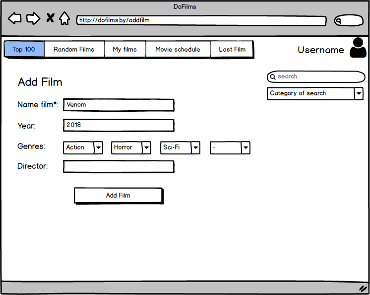
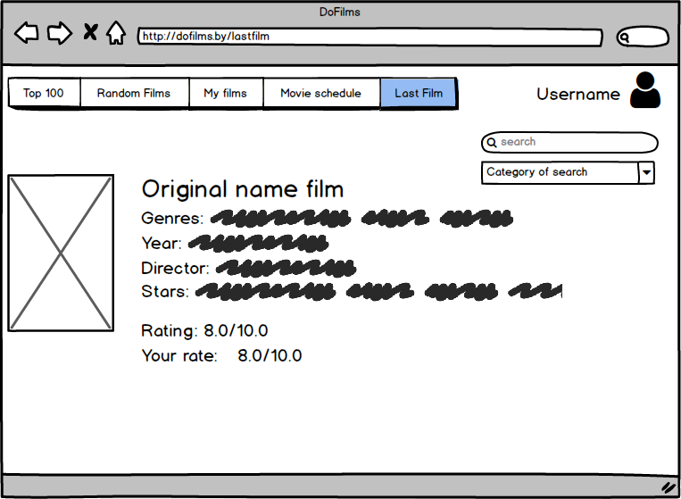

# Требования к проекту
### Содержание
  1. [Введение](#1)  
    1.1 [Назначение](#1.1)  
    1.2 [Бизнес-требования](#1.2)  
      1.2.1 [Исходные данные](#1.2.1)  
      1.2.2 [Границы проекта](#1.2.2)  
    1.3 [Аналоги](#1.3)  
  2. [Требования пользователей](#2)  
    2.1 [Программные интерфейсы](#2.1)  
    2.2 [Интерфейс пользователя](#2.2)  
    2.3 [Характеристики пользователей](#2.3)  
      2.3.1 [Классы пользователей](#2.3.1)  
      2.3.2 [Аудитория приложения](#2.3.2)  
    2.4 [Предположения и зависимости](#2.4)  
  3. [Системные требования](#3)  
    3.1 [Функциональные требования](#3.1)  
      3.1.1 [Вход пользователя в приложение](#3.1.1)  
      3.1.2 [Настройка профиля пользователя](#3.1.2)  
      3.1.3 [Основной функционал приложения](#3.1.3)  
    3.2 [Нефункциональные требования](#3.2)  
      3.2.1 [Атрибуты качества](#3.2.1)  
      3.2.2 [Бизнес-правила](#3.2.2)  
      3.2.3 [Внешний интерфейс](#3.2.3)  
      3.2.4 [Ограничения](#3.2.4)  
    

### 1 Введение 
#### 1.1 Назначение 

Данный документ описывает функциональные и нефункциональные требования к веб-приложению "DoFilms".

#### 1.2 Бизнес-требования 
##### 1.2.1 Исходные данные 

Киноиндустрия развивается с каждым днем. Сложно уследить за фильмами которые выходят, сложно уследить за фильмами которые человек уже посмотрел. Также сложно и выбрать фильм на сегодняшний вечер. Данное приложение поможет с каждой из этих проблем. 

##### 1.2.2 Границы проекта 

Приложение позволит создавать свою библиотеку фильмов, планировать просмотр фильмов. Позволит ставить оценки проссмотренному фильму. Поиск по библиотеке фильмов по различным категориям. Обогащение базы данных фильмов в данном приложении.

#### 1.3 Аналоги 
Главными аналогами разрабатываемого проекта являются:
1. [КиноПоиск](https://www.kinopoisk.ru) — полностью имеет функционал данного веб-приложения, но помимио этого содержит много дургого функционала который иногда отвлекает, сбивает с толку. Также имеется большое количество рекламы.
2. [IMDb](https://www.imdb.com) — зарубежный аналог КиноПоиску. Имеет такие же проблемы.

### 2. Требования пользователей 
#### 2.1 Программные интерфейсы 
Проект использует фреймворки Spring, Hibernate, а также базу данных MySQL.

#### 2.2 Интерфейс пользователя 
- Главная страница приложения
  
- Страница для регистрации пользователя
  
- Страница для авторизации пользователя
  
- Страница добавления фильма
  
- Страница отдельного фильма
  

#### 2.3 Характеристики пользователей 
##### 2.3.1 Классы пользователей 
| Класс | Описание |
|:---|:---|
| Анонимные пользователи | Пользователи, которые не зарегистрированы в приложении либо не авторизованы. Могут только использовать поиск, и просматривать информацию о фильмах |
| Зарегистрированные пользователи | Данные пользователи имеют доступ к полному функционалу приложения, включая возможность пополнения базы данных фильмов в приложении. |
| Администраторы | Особые пользователи, которые могут редактировать всю информацию, а также просматривать предложения от зарегестрированных пользователей о пополнении базы данных фильмов. |

##### 2.3.2 Аудитория приложения 

Аудитория представляет из себя людей любого возраста и уровня образования имеющие возомжность просматривать фильмы. 

#### 2.4 Предположения и зависимости 
Приложение работает только при наличии браузера и постоянного подключения к интернету.

### 3 Системные требования 
#### 3.1 Функциональные требования 
##### 3.1.1 Вход пользователя в приложение 
**Описание.** Пользователь имеет возможность использовать приложение без создания собственного профиля либо войдя в свою учётную запись.

| Функция | Требования |
|:---|:---|
| Вход в приложение без создания собственного профиля | Приложение должно предоставить пользователю возможность войти в приложение, но с ограничением возможностей |
| Регистрация нового пользователя | Приложение должно запросить у пользователя ввести всю необходимую информацию для создания учётной записи. Пользователь должен либо ввести, либо отменить действие |
| Вход зарегистрированного пользователя в приложение | Приложение должно запросить у пользователя ввести имя и пароль для авторизации. Если данные введены верно, то пользователю разблокируется функционал, в противном случае приложение должно запросить повторный ввод |
| *Пользователь с таким именем существует* | *Приложение должно известить пользователя об ошибке регистрации и запросить ввод* |

##### 3.1.2 Настройка профиля пользователя 
**Описание.** Зарегистрированный пользователь имеет возможность редактировать свою личную информацию.

| Функция | Требования |
|:---|:---|
| Изменение личной информации | Приложение должно предоставить пользователю возможность изменить имя, фамилию, паролб, логин и адрес электронной почты |
| Удаление профиля | Приложение должно предоставить пользователю возможность полного удаления своего аакаунта |

##### 3.1.3 Основной функционал приложения 
**Описание.** Зарегистрированный пользователь имеет доступ ко всему функционалу.

| Функция | Требования |
|:---|:---|
| Добавление фильма | Приложение предоставляет зарегистрированному пользователю возомжность заполнить информацию о новом фильме |
| Выставление оценки фильму | Пользователь выставляет свою оценку фильму, фильм автоматически добавляется в линчуй "библиотеку" фильмов |
| Планирование просмотра фильма | Пользователь добавляет фильм в список "Хочу посмотреть" |
| Получение случайного фильма | Пользователю на странице предлагаются 10 случайных фильмов для просмотра |

#### 3.2 Нефункциональные требования 
##### 3.2.1 Атрибуты качества 

Проект должен быть небольшим (иметь малое количество страниц).

##### 3.2.2 Бизнес-правила 

Проект не должен нарушать законодальство государства, и лицензинные права кинокомпаний.

##### 3.2.3 Внешний интерфейс 
Сайт должен:
- быть разработан в одном, минималистичном стиле;
- работать корректно во всех браузерах.

##### 3.2.4 Ограничения 

Вся информация (профили пользователей, информация о фильмах) хранится в базе данных.

